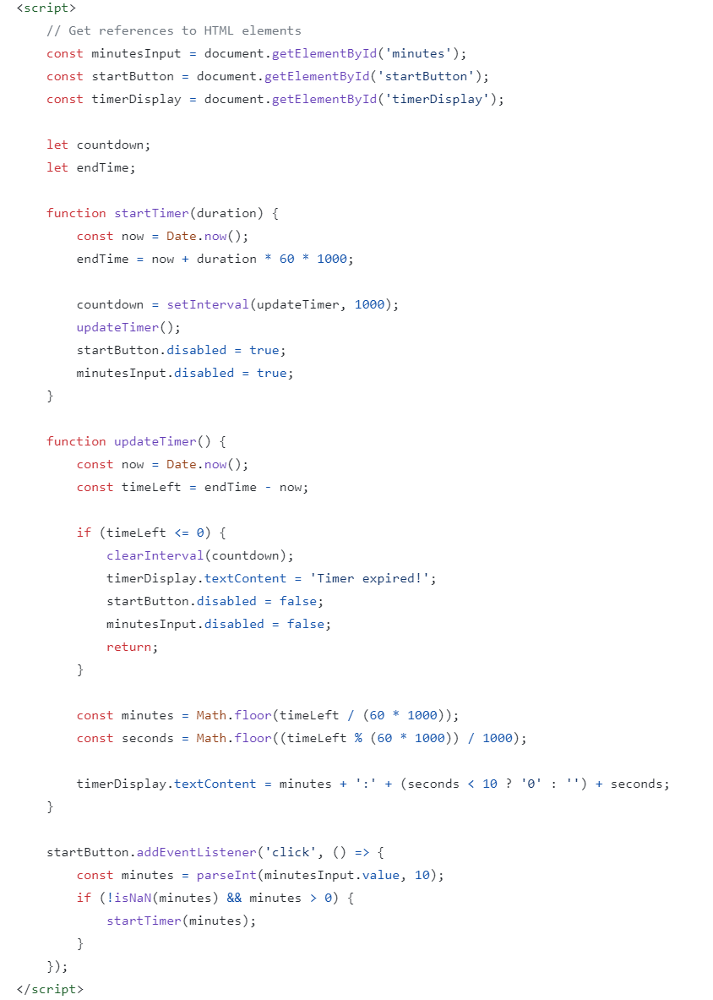

When I was trying to teach myself how to code in 2019 one of the project ideas that was recommended to 
newbies was related to creating a simple timer. This was what I came up with. The style is very plain 
and you can only set the time to minutes but it runs and I am rather proud of that.


 
Source: <a href="https://github.com/bjsisounthone/timer/tree/main/timer">basicTimer/timer</a>
